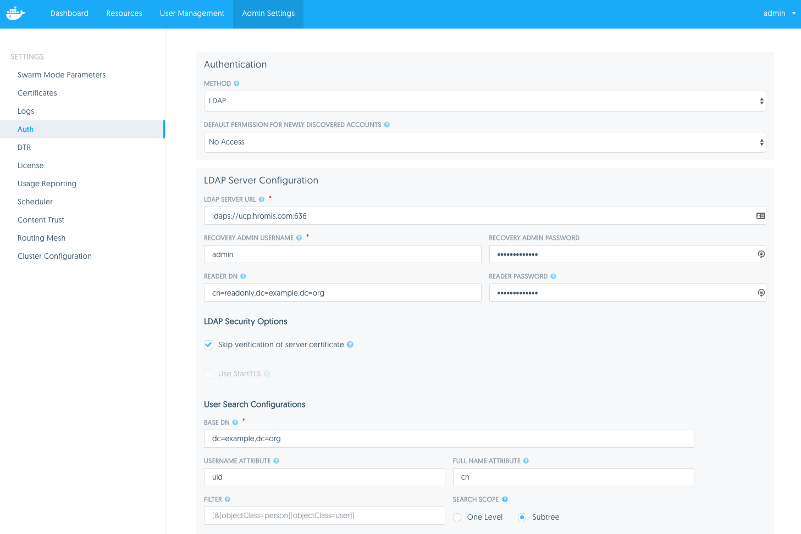

# OpenLDAP Example Users Bootstrap

This repository bootstraps OpenLDAP with example users for easy use with UCP for demos and testing without having to rely on AD running in your environment. It extends the <https://github.com/osixia/docker-openldap> repository by bootstrapping an example set of users. It also bootstraps each user with the same password to simplify usage.

## Usage

1. Clone this repo
2. Fill in desired environment variables in the `docker-compose.yml`
    - More information here: <https://github.com/osixia/docker-openldap#environment-variables>
    - Note: The only password variable that is evaluated is `LDAP_ADMIN_PASSWORD`. The rest are set to this value.
3. While using the UCP client bundle `docker-compose up -d`

> **Note:** If no password is entered for the `LDAP_ADMIN_PASSWORD` environment variable then a random one of 14 characters will be auto-generated. Otherwise an 8 character password minimum length is required if a password is supplied.

If no password was supplied, view the auto-generated password by view the first few lines of the OpenLDAP container. It will look similar to this:

```
openldap        | #################################################
openldap        | The password for all users is: <password>
openldap        | #################################################
```

When OpenLDAP starts, TLS certs are auto-generated based on the container hostname.

## Using with UCP

In order to use this newly bootstrapped OpenLDAP container with UCP do the following:

1. As the admin user navigate to the **Admin Settings** page.
2. Select **Auth** from the left-hand pane.
3. Change **Method** to **LDAP** under **Authentication**
4. **LDAP Server Configuration**
    - **LDAP SERVER URL**
        - Set to `ldaps://<DNS or IP of host running the OpenLDAP container>:636`
    - **RECOVERY ADMIN USERNAME/PASSWORD**
        - Enter in a username and password for logging in if auth is misconfigured or LDAP is unavailable.
    - **READER DN**
        - `cn=readonly,dc=example,dc=org`
    - **READER PASSWORD**
        - Enter the password.
5. **LDAP Security Options**
    - Since this is using self-signed certs, select **Skip verification of server certificate**
6. **User Search Configurations**
    - **BASE DN**
        - `dc=example,dc=org`
    - **USERNAME ATTRIBUTE**
        - `uid`
    - **FULL NAME ATTRIBUTE**
        - `cn`
    - **FILTER**
        - Leave blank
    - **SEARCH SCOPE**
        - `Subtree`
7. **Test LDAP Connection**
    - **LDAP TEST USERNAME**
        - `rms`
    - **LDAP TEST PASSWORD**
        - Enter the password.
    - Verify that when you click **Test** that you get a "LDAP Test Succeeded" message.
8. If you are able to successfully test the LDAP connection then select **Update Auth Settings**.
    - Users should now populate under the **User Management** tab.

Below is a screenshot from UCP:



## PHP LDAP Admin

When launching the compose file another application called PHP LDAP Admin is started as well. It provides an interface to the LDAP directory.

To access the interface go to:

1. `http://<DNS or IP of host running the PHP Admin container>:8080`
2. **Login DN**
    - `cn=admin,dc=example,dc=org`
3. **Password**
    - Enter the password.

## Troubleshooting

To check that you can read the LDAP directory:

### Unencrypted

`ldapsearch -x -H ldap://<address>:389 -b dc=example,dc=org -D "cn=admin,dc=example,dc=org" -w <password>`

### Encrypted

**Note:** MacOS and GNU versions of `ldapsearch` behave differently. These examples work from Linux hosts.

`ldapsearch -x -H ldaps://<address>:636 -b dc=example,dc=org -D "cn=admin,dc=example,dc=org" -w <password>`

With debug to troubleshoot TLS issues:

`ldapsearch -d1 -x -H ldaps://<address>:636 -b dc=example,dc=org -D "cn=admin,dc=example,dc=org" -w <password>`
