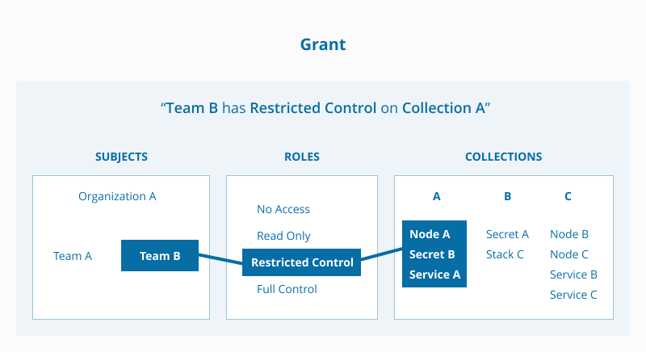

Welcome to the Docker Access Control Lab! In this lab you will learn the tools that are available to you in Docker EE to build multi-tenant container platforms. 

This lab consists of three parts:

 - Setup of the identity backend. Here we will deploy a self-contained LDAP server on UCP and use the accounts here as examples for the rest of the lab. 
- Use Docker EE Access Control for a simple scenario that segments the cluster for two different teams.
- In part 3 we will deploy a more advanced form of access control which segments workloads on different nodes for different teams. 


## Lab Part 1 - Identity Setup (LDAP/AD Configuration)


In this step we will setup an identity provider within UCP. Normally this would be outside of the container cluster.


1.1 Git clone this lab directory to your UCP controller node and then `cd` in to that directory

```
~ $ git clone https://github.com/mark-church/docker-access-control.git
~ $ cd docker-access-control
```

1.1. Log in to your UCP controller node. Run `docker node ls` to confirm that your UCP cluster is running here and that you have three nodes in the cluster.

```
~/docker-access-control $ docker node ls
ID                            HOSTNAME            STATUS              AVAILABILITY        MANAGER STATUS
fq9r10gqh4d1ufpsb83wqssaz *   manager1            Ready               Active              Leader
zggujvv9fges7cvdo40a4bb54     worker1             Ready               Active
```

1.2 Deploy the OpenLDAP server by deploying it as a service from the compose file in this folder.

```
~/docker-access-control $ docker stack deploy -c docker-compose.yml ldap
Creating network ldap_default
Creating service ldap_openldap
```

1.2 Verfiy that your OpenLDAP container is functional by checking that it is up. 

```
~/docker-access-control $ docker ps
CONTAINER ID        IMAGE                        COMMAND                  CREATED             STATUS              PORTS               NAMES
a91c1acf821a        chrch/ldap:latest            "/container/tool/b..."   29 minutes ago      Up 29 minutes       389/tcp, 636/tcp    ldap_openldap.1.tevp0yays03grlqipx8fs4gk5
```

1.3 Now use the following command to check the LDAP entries. Use the container ID from the above command to insert into this command where it says `<container_id>`.

```
~/docker-access-control $ docker exec $LDAP_CTR_ID ldapsearch -x -h localhost -b dc=example,dc=org -D "cn=admin,dc=example,dc=org" -w xFkUicTW01eDVF
```

You should get an output that shows the `example` org.
Good job! Your LDAP server is fully functional and has the entries in it to complete the rest of the lab.

1.4 Log in to UCP with the credentials provided to you and go to Admin / Admin Settings / Authentication & Authorization. This is the page where you will be filling out the configuration to connect with LDAP.


You will edit the following default values:

- **Default Role For All Private Collections:** None
- **LDAP Enabled:** Yes
- **LDAP Server URL:** `ldaps://localhost:636`
- **Reader DN:** `cn=admin,dc=example,dc=org`
- **Reader Password:** password
- **Skip TLS Verification:** Checked
- **Just-In-Time User Provisioning:** Unchecked


1.5 Check "Add LDAP User Search Configuration" and fill in the following values.

- **Base DN:** `dc=example,dc=org`
- **Username Attribute:** `uid`
- **Fullname Attribute:** `cn`
- **Filter:** Leave blank
- **Search Subtree Instead Of Just One Level:** Checked


1.6 Click save. Test the connection by putting in the credentials of one of the users under the "LDAP TEST LOGIN" area.

- **Username:** `grant`
- **Password:** `docker123`

Congratulations you have now linked your identity provider with UCP and UCP has ingested the user accounts so that users can login and get authenticated.


## Docker Enterprise Access Control

### Cluster Role-Based Access Control
Docker EE 17.06 introduced a greatly [enhanced Access Control system](https://docs.docker.com/datacenter/ucp/2.2/guides/access-control/) for [UCP 2.2.](https://docs.docker.com/datacenter/ucp/2.2/guides/release-notes/)  The new Access Control model provides an extremely fine-grained control of what resources users can access within a cluster. Use of RBAC is **highly** recommended for a secure cluster. Security principles of _least privilege_ dictate the use of access control to limit access to resources whenever possible.

#### Access Control Policy

Docker EE Access Control is a policy-based model that uses access control lists (ACLs) called **grants** to dictate access between users and cluster resources. A grant ties together _who_, has permission for _which actions_, against _what resource_. They are a flexible way of implementing access control for complex scenarios without incurring high management overhead for the system administrators.

As shown below, a grant is made up of a *subject* (who), *role* (which permissions), and a *collection* (what resources). 



> **Note:** It is the UCP administrators' responsibility to create and manage the grants, subjects, roles, and collections. 

#### Subjects

A subject represents a user, team, or organization. A subject is granted a role for a collection of resources. These groups of users are the same across UCP and DTR making RBAC management across the entire software pipeline uniform. 

- **User**: A single user or system account that an authentication backend (AD/LDAP) has validated. 
- **Team**: A group of users that share a set of permissions defined in the team itself. A team exists only as part of an organization, and all team members are members of the organization. A team can exist in one organization only. Assign users to one or more teams and one or more organizations.
- **Organization**: The largest organizational unit in Docker EE. Organizations group together teams to provide broader scope to apply access policy against.

#### Roles and Permissions

A role is a set of permitted API operations that you can assign to a specific subject and collection by using a grant. Roles define what operations can be done against cluster resources. An organization will likely use several different kinds of roles to give the right kind of access. A given team or user may have different roles provided to them depending on what resource they are accessing. There are default roles provided by UCP, and there is also the ability to build custom roles.

##### Custom Roles

Docker EE defines very granular roles down to the Docker API level to match unique requirements that an organization may have. [Roles and Permission Levels](https://docs.docker.com/datacenter/ucp/2.2/guides/access-control/permission-levels/) has a full list of the operations that can be used to build new roles.


#### Collections
Docker EE enables controlling access to swarm resources by using *collections*. A collection is a grouping of swarm cluster resources that you access by specifying a directory-like path.  Before grants can be implemented, collections need to be designed to group resources in a way that makes sense for an organization.

The following example shows the potential access policy of an organization. Consider an organization with two application teams, Mobile and Payments, that share cluster hardware resources, but still need to segregate access to the applications. Collections should be designed to map to the organizational structure desired, in this case the two application teams. 


> **Note:** Permissions to a given collection are inherited by all children of that collection.

Collections are implemented in UCP through the use of Docker labels. All resources within a given collection are labeled with the collection, `/production/mobile` for instance. 

Collections are flexible security tools because they are hierarchical. For instance, an organization may have multiple levels of access. This might neccessitate a collection architecture like the following:


## Lab Part 2 - Basic Access Control


